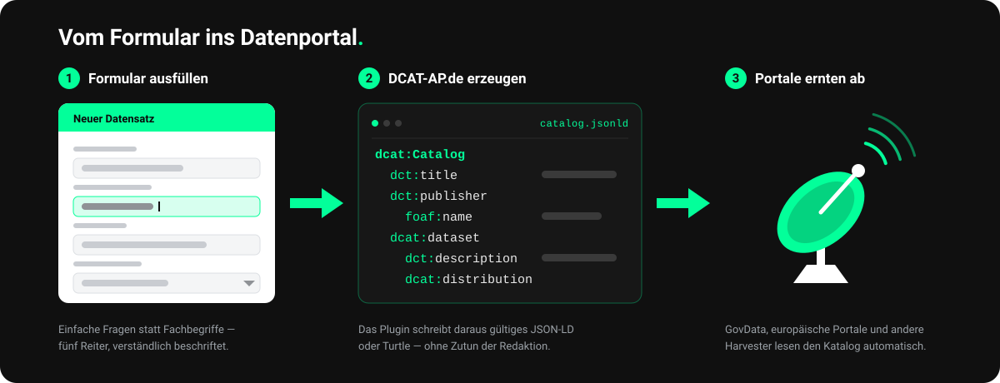

<p align="center">
  
</p>

<h1 align="center">Open Data Wizard</h1>

<p align="center">
  
  
  
  = 8.1">
  
  
</p>

<p align="center">
  <a href="DOCUMENTATION.md">Dokumentation</a> ·
  <a href="docs/FELD-REFERENZ.md">Feld-Referenz</a> ·
  <a href="TECHNICAL-SPEC.md">Technische Spezifikation</a> ·
  <a href="CHANGELOG.md">Changelog</a> ·
  <a href="SECURITY.md">Security</a> ·
  <a href="LICENSE">Lizenz</a>
</p>

<p align="center">
  <strong>Ein WordPress-Plugin zur einfachen Veröffentlichung offener Daten nach DCAT-AP 3.0</strong>
</p>

Open Data Wizard ermöglicht es Organisationen und Einzelpersonen, Datensätze direkt in WordPress zu beschreiben und als maschinenlesbare, standardkonforme Metadaten bereitzustellen — ohne technische Vorkenntnisse, ohne externe Plattformabhängigkeit.

---

## Das Problem

Offene Daten zu veröffentlichen ist schwieriger, als es sein müsste. Wer es versucht, stößt meist auf drei Hürden:

**Die Fachsprache.** Datenkataloge verlangen Metadaten nach dem europäischen Standard DCAT-AP: `dct:publisher`, `dcat:accessURL`, `dcatde:politicalGeocodingLevelURI`. Wer damit nicht täglich arbeitet, weiß nicht, was gemeint ist — und rät.

**Die Plattformabhängigkeit.** Der übliche Weg führt über ein fremdes Portal: dort registrieren, dort einpflegen, dort pflegen. Die Organisation gibt Kontrolle ab und bindet sich an eine Infrastruktur, die ihr nicht gehört.

**Der technische Aufwand.** Wer selbst hosten will, braucht einen Katalogserver, RDF-Kenntnisse und jemanden, der das betreibt. Für eine Organisation mit drei Datensätzen steht das in keinem Verhältnis.

Dabei besitzen viele dieser Organisationen längst eine Infrastruktur, die sie kennen und kontrollieren: **eine WordPress-Website.**

**Hier setzt der Open Data Wizard an.**

---

## Die Idee

Das Plugin bringt einen geführten Metadaten-Wizard ins WordPress-Backend. Organisationen beschreiben ihre Datensätze dort, wo sie ohnehin arbeiten. Das Plugin generiert daraus eine maschinenlesbare Beschreibung nach dem internationalen Standard **DCAT-AP 3.0** und stellt sie unter einer persistenten URL bereit.

Open-Data-Portale binden diese URL als Harvest-Quelle ein und holen sich die Metadaten selbst ab — regelmäßig und automatisch.

Der entscheidende Unterschied: **Die Daten bleiben bei der Organisation. Der Katalog kommt zu ihr.** Es wandern ausschließlich *Metadaten* — die Beschreibung der Daten — zum Portal, nie die Daten selbst. Und dieselben Metadaten lassen sich an beliebig viele Portale gleichzeitig ausliefern, ohne sie mehrfach zu pflegen.

<p align="center">
  
</p>

---

## Was ist DCAT-AP?

DCAT-AP (Data Catalog Vocabulary — Application Profile) ist ein europäischer Standard zur Beschreibung von Datensätzen und Datenkatalogen. Er definiert, welche Angaben ein Datensatz braucht, damit er von Plattformen, Suchmaschinen und Anwendungen einheitlich gelesen und verarbeitet werden kann — Titel, Beschreibung, Lizenz, Format, Herausgeber und mehr.

Open Data Wizard implementiert **DCAT-AP 3.0** und erzeugt valide **JSON-LD**-Ausgaben.

---

## Für wen ist das Plugin?

- **Vereine, Stiftungen und NGOs** — Mitgliederstatistiken, Förderdaten, Wirkungsberichte, Messreihen. Meist ohne eigene IT-Abteilung, aber mit vorhandener WordPress-Seite.
- **Forschungseinrichtungen und Bildungsträger** — Forschungsdaten unter offener Lizenz. Die CESSDA-Klassifikation und die Felder für Urheber, Version und Herkunft zielen genau darauf.
- **Kommunen und öffentliche Einrichtungen** — Bereitstellungspflichten erfüllen, ohne ein eigenes Portal zu betreiben. Die DCAT-AP.de-Felder für amtliche Gebietsschlüssel und Verwaltungsebenen sind vorhanden.
- **Portalbetreiber** profitieren indirekt: standardkonforme Quellen, die sich einfach anbinden lassen, statt manuell nachgepflegter Metadaten.

---

## Funktionsübersicht

### 🗂 Datensätze verwalten
Eigener Bereich im WordPress-Backend mit Übersicht, Filterung und Statusverwaltung (Entwurf / Veröffentlicht).

### 😊 Benutzerfreundliche Formularsprache
Das Wizard-Formular wurde vollständig überarbeitet, um es auch ohne DCAT-AP-Kenntnisse intuitiv zu machen:
- **Klare Fragen statt technischer Begriffe:** Statt „Herausgebende Organisation (dct:publisher)" fragt das Plugin: „Wer gibt diese Daten heraus?"
- **Hilfreiche Beispiele:** Jedes Feld hat konkrete, praxisnahe Beispiele
- **Ursprüngliche Labels in Hilfetexten:** DCAT-AP Bezeichnungen und technische Details bleiben in den Hilfetexten sichtbar
- **Validierungsmeldungen in Klartext, mit Ort:** Wird die Veröffentlichung blockiert, nennt die Meldung den Tab und den verständlichen Feldnamen (der technische DCAT-AP-Begriff steht nur klein daneben) — ein Klick auf „Zum Feld springen" öffnet den passenden Tab und hebt das Feld hervor

### 🧭 Geführter Wizard
Fünf-Tab-Assistent mit praktischen Beispielen. Pflichtfelder sind mit einem roten Sternchen (`*`) gekennzeichnet; als **Entwurf** lässt sich jederzeit unvollständig speichern — erst zum **Veröffentlichen** müssen alle Pflichtangaben ausgefüllt sein.

1. **Grundlegende Informationen** — „Wer gibt diese Daten heraus?", „Worum geht es in diesem Datensatz?", „Welchem Thema ist dieser Datensatz zugeordnet?", „Mit welchen Schlagworten finde ich diese Daten?". Weniger häufige Einordnungen (CESSDA-Themenklassifikation, ZiviZ-Engagementfeld) liegen in einer aufklappbaren Untergruppe am Tab-Ende.
2. **Sprache & Übersetzungen** — die Sprache der Daten sowie Titel, Beschreibung und Schlagworte in weiteren Sprachen
3. **Datenbereitstellung** — Zugriffs-URL **oder** Datei-Upload (Mediathek), Format, Dateigröße, **Lizenz (Pflicht je Distribution)**, Namensnennungstext; optional weitere Distributionen (wiederholbar)
4. **Erweiterte Angaben** — Projektseite, Erstveröffentlichung, Aktualisierungsfrequenz, geografische und zeitliche Abdeckung, Kontaktinformationen, Verantwortlichkeiten (Urheber/pflegende Stelle, GovData-Contributor-ID), High-Value-Datensatz (HVD) Kategorie
5. **Vorschau** — generiertes JSON-LD live einsehen

### 🏷 Lizenz-Auswahl
- Vordefinierte Auswahlliste mit ausgeschriebenen Lizenznamen (z. B. „CC BY 4.0 — Namensnennung")
- Unter der Auswahl erscheint eine allgemeinverständliche Erklärung, was die gewählte Lizenz erlaubt
- Option „Sonstige" öffnet ein Freitextfeld mit Auto-Suggest aus `config/licenses.txt`
- Lizenz ist **Pflichtfeld pro Distribution** (nicht am Datensatz selbst)

### 🧾 Metadatenfelder & kontrollierte Vokabulare

**53 dokumentierte Felder** — die vollständige Referenz mit DCAT-AP-Definition und
allgemeinverständlicher Erklärung je Feld steht in [`docs/FELD-REFERENZ.md`](docs/FELD-REFERENZ.md).

- **Pflicht:** `dct:title`, `dct:description`, `dct:publisher`, `dct:license` + `dcat:accessURL`
- **DCAT-AP.de:** `dcatde:contributorID`, `originator`, `maintainer`, amtlicher Gebietsschlüssel
  (`politicalGeocodingURI`), Verwaltungsebene, Rechtsgrundlage, Qualitätsprozess, Namensnennungstext
- **High-Value-Datensätze:** `dcatap:hvdCategory` + `applicableLegislation` (EU-DVO 2023/138)
- **Mehrsprachigkeit:** Titel, Beschreibung und Schlagworte je Sprache als `@language`/`@value`
- **Mehrere Distributionen** je Datensatz — dieselben Daten z. B. als CSV *und* JSON, jeweils mit
  eigener Lizenz, Größe und Format

**Statt Freitext kontrollierte Vokabulare:** Themen, Dateiformate, Sprachen (alle 24 EU-Amtssprachen), Lizenzen, Zugriffsrechte
und Aktualisierungsfrequenzen stammen aus den offiziellen EU- und DCAT-AP.de-Listen. Sie wählen
„Umwelt" — gespeichert wird die dazugehörige URI.

### 🎓 CESSDA-Themenklassifikation
Auswahlfeld aus der CESSDA Topic Classification 4.2.3 (95 deutsche Konzepte, SKOS/RDF, 24h Cache). Im Feld wird das sprechende Label (z. B. „Bildung") angezeigt; die zugehörige URI wird im Hintergrund gespeichert und als Hinweis eingeblendet.

### 🗺 Geografische Region (GeoNames)
Kuratierte Auswahlliste (Deutschland, alle 16 Bundesländer, größere Städte). Die Auswahl wird im JSON-LD automatisch mit der passenden GeoNames-URI verknüpft; Freitext und eigene URIs bleiben möglich.

### 📥 Batch-Import (CSV & JSON)
```
Datensätze → Batch-Import
```
Importiere mehrere Datensätze auf einmal aus CSV oder JSON Dateien. Der Import-Wizard zeigt eine Vorschau aller gültigen Zeilen, markiert Fehler, und lässt dich auswählen, welche Datensätze importiert werden. Alle importierten Datensätze werden als **Entwürfe** erstellt — zur Bearbeitung vor Publishing bereit.

**Unterstützte Formate:**
- **CSV**: Spaltenköpfe = Feldnamen (title, publisher, description, access_url, license, theme, language, format, issued, keywords, byte_size, attribution)
- **JSON**: Array von Objekten oder einzelnes Objekt mit gleichen Feldnamen

**Pflichtfelder beim Import:**
- `title` — Datensatztitel
- `publisher` — Herausgebende Organisation
- `description` — Beschreibung (Mindestens 10 Zeichen)
- `access_url` — Download-URL (muss mit http/https beginnen)
- `license` — Lizenz (short code wie `cc-by` oder volle URI)

**Optionale Felder:**
- `theme` — Thema (z.B. SOCI, ECON, EDUC)
- `language` — Sprache (z.B. de, en)
- `format` — Dateiformat (z.B. CSV, JSON, PDF)
- `issued` — Veröffentlichungsdatum
- `keywords` — Schlagworte (komma-getrennt)
- `byte_size` — Dateigröße in Bytes (nur ganze Zahl; abweichende Werte werden als Fehler markiert)
- `attribution` — Namensnennungstext

**Gut zu wissen:**
- **Excel-kompatibel:** UTF-8-CSVs mit BOM (Excel-Standardexport) werden korrekt eingelesen.
- **Limit:** Bis zu **2.000 Datensätze** pro Import (Schutz vor Speicher-/Timeout-Problemen).
- **Sicherheit:** Zell-Inhalte, die als Tabellen-Formel interpretiert werden könnten (Beginn mit `=` `+` `@` `-`), werden beim Import automatisch neutralisiert; Datei-Typ wird anhand der echten Endung geprüft, nicht des Browser-MIME-Typs.

Die Batch-Import-Seite ist vollständig ins WordPress-Admin-Design integriert (Standard-Buttons, dezente Icons).

[📥 CSV-Beispiel herunterladen](./samples/import-example.csv)  |  [📄 JSON-Beispiel](./samples/import-example.json)

### 📎 Datei-Upload (Mediathek)
Steht in Tab 3 direkt unter der Zugriffs-URL, zu der er die Alternative ist:
- „Datei auswählen / hochladen"-Button öffnet den nativen WordPress Media Library Frame
- Beim Speichern werden `_odw_file_size` (Bytes) und `_odw_file_format` (z.B. „CSV") automatisch berechnet
- Sicherheit: `wp_verify_nonce` + `current_user_can('edit_post')`

### ⚙️ Einstellungsseite
Untermenü unter *Datensätze → Einstellungen* mit vier Bereichen:
- **Katalog** — Titel und Herausgebende Organisation
- **Standardwerte** — Standard-Sprache (wird bei neuen Datensätzen vorausgefüllt)
- **REST API** — Cache-Laufzeit (60–86400 Sekunden)
- **Deinstallation** — Opt-in Checkbox für vollständige Datenlöschung

### 📊 Qualitätsindikatoren
Automatische Metadaten-Qualitätsprüfung nach der [EU-MQA-Methodik](https://data.europa.eu/mqa/methodology). Der Leitwert ist überall **Prozent + Stufe** (z. B. „72 % · Gut"):

| Stufe | Prozent | Bedeutung |
|---|---|---|
| Ausgezeichnet | ≥ 87 % | nahezu vollständig |
| Gut | 55–86 % | über der Mindestanforderung |
| Ausreichend | 30–54 % | Grundangaben vorhanden |
| Mangelhaft | < 30 % | wesentliche Angaben fehlen |

Berechnung nach jedem Speichern. Die **Listenspalte** zeigt Prozent + Stufe; die **Qualitäts-Meta-Box** ergänzt den MQA-Rohwert (z. B. „54 / 259 Punkte, von max. 405") als Detailzeile.

### 📥 Download-Card — Block oder Shortcode

Zwei Wege zur selben Karte. **Empfohlen ist der Block:**

Im Beitrags- oder Seiteneditor über das Plus-Symbol **„Datensatz-Karte"** einfügen und rechts in
der Seitenleiste den Datensatz aus einer Liste wählen — keine ID zum Abtippen. Zur Auswahl stehen
nur veröffentlichte Datensätze.

Alternativ der Shortcode, etwa in klassischen Editoren oder Widgets:

```
[odw_dataset id="123"]
```

Beide rendern dieselbe strukturierte Download-Card im Frontend: Titel, Thema-Badge, Lizenz,
Schlagwörter als Tag-Pillen, Download-Button sowie einen **Metadaten-Download-Button (JSON-LD)**.
CSS (`assets/css/frontend.css`) wird nur auf Seiten geladen, die die Karte auch enthalten.

Der Block speichert ausschließlich die Datensatz-ID und rendert beim Ausliefern — ein später
umbenannter Datensatz erscheint also mit seinem aktuellen Titel, statt eine eingefrorene Kopie im
Beitrag zu hinterlassen.

### 🔗 REST API Endpoints

```
GET https://deine-website.de/wp-json/datenatlas/v1/catalog
GET https://deine-website.de/wp-json/datenatlas/v1/datasets/<id>
GET https://deine-website.de/wp-json/datenatlas/v1/delta?since=<ISO8601>
```

Diese URLs können bei einer Open-Data-Plattform als Harvest-Quelle eingetragen werden — einmalig, ohne weiteren Aufwand.

**Catalog-Parameter:** `page`, `per_page`, `theme`, `license`, `format` (`jsonld`, `json` oder `turtle`), `full`

**Content Negotiation:** Alle drei Endpunkte liefern `jsonld`, `json` und `turtle`. Ohne `?format=` entscheidet der **`Accept`-Header** (mit q-Werten); ein explizites `?format=` hat immer Vorrang. Antworten tragen `Vary: Accept`.

**Delta-Parameter:** `since` (erforderlich, ISO 8601), `page`, `per_page`, `format` — liefert nur Datensätze, die nach dem angegebenen Zeitstempel geändert wurden, plus Tombstones für gelöschte Datensätze

### 🌾 Harvesting durch externe Open-Data-Portale

Viele Open-Data-Portale holen Metadaten per **Pull-Harvesting** ab: Sie hinterlegen beim Portal **eine stabile URL**, unter der Ihr **kompletter Katalog als ein DCAT-AP.de-Dokument** liegt. Genau dafür bietet der Catalog-Endpoint einen **Voll-Modus**:

```
# Vollständiger Katalog als Turtle (empfohlen für RDF-Harvester)
GET https://deine-website.de/wp-json/datenatlas/v1/catalog?full=1&format=turtle   →  text/turtle

# … oder als JSON-LD
GET https://deine-website.de/wp-json/datenatlas/v1/catalog?full=1                 →  application/ld+json
```

- **`full=1`** liefert **alle veröffentlichten Datensätze in einem Abruf** (ohne Paginierung) als `dcat:Catalog` → `dcat:Dataset` → `dcat:Distribution` — das Muster, das RDF-Harvester erwarten.
- **`format=turtle`** serialisiert denselben Graphen als **Turtle** (`text/turtle`) — ohne externe RDF-Bibliothek. JSON-LD (`application/ld+json`) und `json` bleiben verfügbar. Harvester, die rein über Header aushandeln, senden stattdessen `Accept: text/turtle`.
- Die Datensatz-URIs (`@id`) sind **über Releases stabil** (an die Post-ID gebunden), sodass Harvester Aktualisierungen/Löschungen korrekt zuordnen und keine Duplikate anlegen.

Die fertigen Harvest-URLs zeigt das Plugin **kopierfertig unter _Datensätze → Einstellungen → Harvesting_** an.

### ✅ DCAT-AP 3.0 Konformität — nachgewiesen, nicht behauptet

Alle Ausgaben folgen DCAT-AP 3.0 / DCAT-AP.de. Die erzeugten Dokumente wurden gegen die
**offiziellen SHACL-Regeldateien** geprüft — beide Profile melden `Conforms: True`:

| Profil | Quelle | Ergebnis |
|---|---|---|
| **DCAT-AP.de** | GovData (v3.0) | ✅ konform |
| **DCAT-AP 3.0 (EU)** | SEMICeu (Release 3.0.0) | ✅ konform |

Diese Regeldateien liegen dem Plugin bei (siehe unten), sodass Sie **vor** der Anmeldung bei einem
Portal selbst prüfen können.

### 🔎 DCAT-AP-Validierung (SHACL)

Ob die erzeugten Metadaten dem Standard **formal** entsprechen, lässt sich mit **SHACL** prüfen — der
offiziellen Regelsprache, mit der die EU und GovData DCAT-AP-Konformität definieren. Damit du nicht auf
inoffizielle Regeln angewiesen bist, bringt das Plugin die **maßgeblichen, offiziellen Shape-Dateien**
gebündelt mit (unter [`config/shacl/`](config/shacl/)):

| Datei | Herkunft | Zweck | Lizenz |
|---|---|---|---|
| `dcat-ap-SHACL.ttl` | [SEMICeu/DCAT-AP](https://github.com/SEMICeu/DCAT-AP) (Release 3.0.0) | generische **EU-DCAT-AP-3.0**-Regeln | CC BY 4.0 |
| `dcat-ap-SHACL-DE.ttl` | [GovDataOfficial](https://github.com/GovDataOfficial/DCAT-AP.de-SHACL-Validation) (v3.0) | **DCAT-AP.de**-Ergänzungen (u. a. `dcatde:`-Felder, deutschsprachige Meldungen) | CC0 |

> **Wichtig:** Das Plugin führt SHACL **nicht selbst** aus — dafür gibt es in PHP keine praxistaugliche
> Engine. Die Dateien liegen als **Referenz** bei; die eigentliche Prüfung erfolgt über einen externen
> Validierungsdienst oder ein lokales SHACL-Werkzeug. So bleibt das Plugin self-contained und ohne
> Pflicht-Netzwerkzugriff.

#### So validierst du einen Datensatz

1. **JSON-LD abrufen** — jeder veröffentlichte Datensatz ist über die REST-API erreichbar:
   ```
   https://<deine-site>/wp-json/datenatlas/v1/datasets/<ID>
   ```
   (den ganzen Katalog liefert `…/datenatlas/v1/catalog`).

2. **Gegen die Shapes prüfen** — mit einem der offiziellen Dienste (Datei hochladen bzw. JSON-LD einfügen):
   - **EU-Validator (SHACL / ITB):** <https://www.itb.ec.europa.eu/shacl/dcat-ap/upload>
   - **data.europa.eu MQA:** <https://data.europa.eu/mqa/>
   - **DCAT-AP.de-Validator** (Docker/ITB): siehe
     [DCAT-AP.de-SHACL-Validation](https://github.com/GovDataOfficial/DCAT-AP.de-SHACL-Validation)

3. **Oder lokal** validieren, z. B. mit [pySHACL](https://github.com/RDFLib/pySHACL) gegen die gebündelten Shapes:
   ```bash
   # JSON-LD des Datensatzes speichern …
   curl -s "https://<deine-site>/wp-json/datenatlas/v1/datasets/42" -o datensatz.jsonld
   # … und gegen die DCAT-AP.de-Shapes prüfen
   pyshacl -s config/shacl/dcat-ap-SHACL-DE.ttl -df json-ld datensatz.jsonld
   ```

Der Validierungs-Report zeigt Verstöße (`sh:Violation`) mit Pfad und Meldung — so siehst du genau, welches
Feld ggf. nachzubessern ist.

#### Verhältnis zum Qualitäts-Score

Die integrierten **Qualitätsindikatoren** (siehe oben) decken die „gesetzt?"- und Vokabular-Prüfungen der
[EU-MQA-Methodik](https://data.europa.eu/mqa/methodology) bereits offline ab. Die MQA-Metrik
**„DCAT-AP-Konformität" (SHACL, 30 Punkte)** wird davon bewusst **nicht** automatisch bewertet, sondern über
die hier beschriebene externe Validierung geprüft (Ansatz „achievable max"). Details im
[MQA-Konzept](docs/MQA-KONZEPT.md).

---

## Was der Open Data Wizard *nicht* ist

Eine ehrliche Abgrenzung hilft bei der Einordnung:

- **Kein Datenportal.** Das Plugin hostet keine Suchoberfläche und keinen Katalog für Dritte — es
  macht eine einzelne Organisation harvestbar.
- **Kein Datenmanagement-System.** Die eigentlichen Dateien liegen, wo sie liegen: in der Mediathek,
  auf einem Server, in einem Repositorium. Das Plugin *beschreibt* sie, es verwaltet sie nicht.
- **Kein Ersatz für fachliche Sorgfalt.** Es prüft, *ob* eine Lizenz angegeben ist — nicht, ob es die
  richtige ist. Es weist auf fehlende Angaben hin; die inhaltliche Qualität der Beschreibung bleibt
  Aufgabe der Person, die sie schreibt.

---

## Installation

### Für Anwender:innen

1. ZIP-Datei aus den [Releases](https://github.com/daimpad/OpenDataWizard/releases/latest) herunterladen
2. Im WordPress-Backend: **Plugins → Installieren → Plugin hochladen**
3. Plugin aktivieren

Keine weiteren Abhängigkeiten. Keine Programmierkenntnisse erforderlich.

> **Wichtig: das Release-ZIP verwenden, nicht das Quellcode-Archiv.** Der grüne „Code"-Button auf
> GitHub liefert ein Archiv **ohne** die benötigten Programmbibliotheken — damit bleibt das Plugin
> inaktiv und meldet „Installation unvollständig". Nur das unter *Releases* verlinkte
> `open-data-wizard-<version>.zip` ist vollständig.
>
> Dasselbe gilt, wenn Sie aus einer Version **vor 2.34.0** automatisch aktualisiert haben: Einmalig
> das Release-ZIP hochladen behebt es dauerhaft; danach ziehen Updates automatisch das vollständige
> Paket. Ihre Datensätze bleiben dabei erhalten — sie liegen in der Datenbank, nicht in den
> Plugin-Dateien.

### Automatische Updates

Das Plugin meldet neue Versionen im WordPress-Backend (via `GitHub Plugin URI`, ausgewertet von
Git Updater o. ä.). Das Update-Paket kommt aus dem Branch **`release`**, den die CI bei jeder
Veröffentlichung neu erzeugt: Er enthält exakt den Inhalt des Release-ZIPs, also das
installationsfertige Plugin samt `vendor/`.

Der Weg über einen Branch statt über das Release-Asset ist Absicht — er läuft über ein schlichtes
Quellarchiv statt über die GitHub-API und braucht deshalb weder Zugriffstoken noch API-Kontingent.

> **Umstieg auf 2.35.6:** Der Updater liest die Kopfzeilen der *installierten* Version. Wer von
> 2.35.5 oder früher kommt, muss das Release-ZIP **einmalig** von Hand hochladen; ältere
> Installationen zeigen sonst „Aktualisierung fehlgeschlagen. Das Aktualisierungspaket ist nicht
> verfügbar." Ab 2.35.6 laufen Updates dann automatisch durch.

### Für Entwickler:innen

```bash
git clone https://github.com/daimpad/OpenDataWizard.git
cd OpenDataWizard
composer install   # erzeugt vendor/ (Carbon Fields + PHPStan, WPCS, PHPUnit)
```

> **`composer install` ist zwingend erforderlich.** `vendor/` ist bewusst **nicht** im Repository —
> es wird reproduzierbar aus `composer.lock` erzeugt (lokal, in der CI und beim Release-Build).
> Ohne diesen Schritt fehlt Carbon Fields und das Plugin zeigt einen entsprechenden Admin-Hinweis.

Den Plugin-Ordner in eine lokale WordPress-Instanz einbinden (z.B. via [LocalWP](https://localwp.com)).

**Systemvoraussetzungen:**
- WordPress ≥ 6.4
- PHP ≥ 8.1
- Composer (nur für Entwicklung)

**Dev-Tools:**

```bash
composer phpcs      # WordPress Coding Standards prüfen
composer phpcbf     # Automatisch korrigieren
composer phpstan    # Statische Analyse (Level 6)
composer test       # PHPUnit-Tests ausführen
```

CI läuft via GitHub Actions (`.github/workflows/ci.yml`) auf PHP 8.1, 8.2 und 8.3.

**Für Entwickler:** Siehe [`CLAUDE.md`](./CLAUDE.md) für Architektur-Übersicht, Patterns, Debugging-Tipps und Workflows.

---

## 🛠 Technische Dokumentation

Die ausführliche Entwickler-Dokumentation (Architektur, Dateistruktur, DCAT-AP-Feldmapping, REST-API,
Erweiterbarkeit, WP-CLI, Abhängigkeiten) ist in einem eigenen Dokument gepflegt:

**➡️ [DOCUMENTATION.md](DOCUMENTATION.md)**

---

## 🧩 Technische Spezifikationen

Alle technischen Spezifikationen — Metadatenmodell, JSON-LD-Namespaces, kontrollierte Vokabulare, der
vollständige DCAT-AP-/DCAT-AP.de-Feldkatalog mit Gap-Analyse, das Feld-Registry-Schema sowie die phasierte
Umsetzungsplanung samt Umsetzungsstand — sind in einem eigenen Dokument gepflegt:

**➡️ [TECHNICAL-SPEC.md](TECHNICAL-SPEC.md)**

Neue technische Festlegungen gehören in dieses Dokument (nicht in die anwenderorientierten Kapitel oben).

---

## Roadmap

**Abgeschlossen (v1.0 — v2.1):**
- [x] Custom Post Type `odw_dataset` mit DCAT-AP 3.0 Unterstützung
- [x] Five-Tab Wizard-Formular mit Validierung und Hilfetexten
- [x] REST API Endpoints: `/catalog`, `/datasets/<id>`, `/delta?since=<timestamp>`
- [x] Qualitätsindikatoren / 4-Stufen-Ampellogik (Perfekt / Gut / Ausreichend / Verbesserungsbedarf)
- [x] Download-Card Shortcode `[odw_dataset]` mit Keywords und Metadaten-Download
- [x] Demo-Datensatz bei Aktivierung
- [x] Einstellungsseite (Catalog-Titel, Defaults, API, Cleanup)
- [x] Erweiterte DCAT-AP Felder (Tab 4)
- [x] Nativer wp.media Upload-Widget
- [x] Benutzerfreundliche UX-Überarbeitung
- [x] WP-CLI Befehle für Massenoperationen
- [x] Lizenz pro Distribution (DCAT-AP-konform)
- [x] CESSDA-Themenklassifikation (Auto-Suggest aus SKOS/RDF)
- [x] Externe Konfigurationsdateien (licenses.txt, dct-format-list.php, dcat-ap-fields.php)

**In Planung (v2.2+):** — Details siehe [Technische Spezifikationen § 7](TECHNICAL-SPEC.md#7-umsetzungsplanung-phasiert)
- [x] Phase A: Konformitäts-Korrekturen, `@context`-Namespaces und Feld-Registry-Schema (v2.3.2 / 2.4.0 / 2.5.1)
- [x] Phase B: DCAT-AP.de-Felder (contributorID, originator, maintainer, availability) + generisches Vokabular-Autosuggest (v2.5)
- [x] Phase C: HVD-Unterstützung (`dcatap:hvdCategory` + `applicableLegislation`) (v2.4)
- [x] Phase D: Mehrsprachige Literale (`@language`/`@value`) — Titel, Beschreibung und Schlagworte je Sprache
- [x] Phase E: Multi-Distribution — wiederholbare Distributionen (opt-in)
- [x] Phase 3 UX: Tooltip-Popups (ⓘ) und Live-Wizard-Vorschau (Tab 5)
- [x] UX-Ausbau (Paket B, v2.29–2.32): Pflichtfeld-Sternchen + Publish-Validierung, Fehlermeldungen mit „Zum Feld springen", einheitliche Prozent-Qualitätsanzeige, entschlacktes Tab 1, konsistente Begriffe („Thema"/„Schlagworte"), Batch-Import im Admin-Design
- [x] Harvest-Endpoint: Voll-Katalog (`?full=1`) + **Turtle**-Serialisierung (v2.33.0)
- [x] Content Negotiation: Turtle für alle Endpunkte + Auswertung des `Accept`-Headers (v2.35.0)
- [ ] Optional: RDF/XML als weitere Serialisierung
- [ ] Gutenberg Block für die Download-Card
- [ ] Mehrsprachigkeit (WPML/Polylang)

---

## Mitwirken

Beiträge sind willkommen — ob Fehlermeldungen, Verbesserungsvorschläge oder Pull Requests.

Bitte öffne zunächst ein [Issue](https://github.com/daimpad/OpenDataWizard/issues), bevor du größere Änderungen einreichst.

---

## Deinstallation

Das Plugin löscht bei Deinstallation standardmäßig **keine** Daten (Opt-in).

Um alle Plugin-Daten zu löschen, die Checkbox unter **Datensätze → Einstellungen → Deinstallation** aktivieren und dann das Plugin im WordPress-Backend deinstallieren. `uninstall.php` entfernt alle `odw_dataset`-Posts, alle `_odw_*`-Metafelder sowie die Plugin-Optionen.

---

## In einem Satz

Der Open Data Wizard verwandelt eine gewöhnliche WordPress-Website in eine standardkonforme
Open-Data-Quelle — bedienbar von Menschen ohne DCAT-AP-Kenntnisse, anschlussfähig für Portale, die
europäische Standards erwarten, und ohne dass die Organisation Kontrolle über ihre Daten oder ihre
Infrastruktur abgibt.

---

## Lizenz

GPL-2.0-or-later — siehe [`LICENSE`](./LICENSE)
